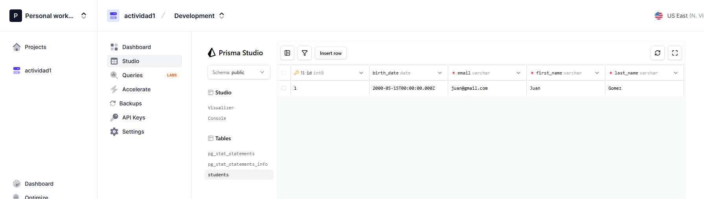
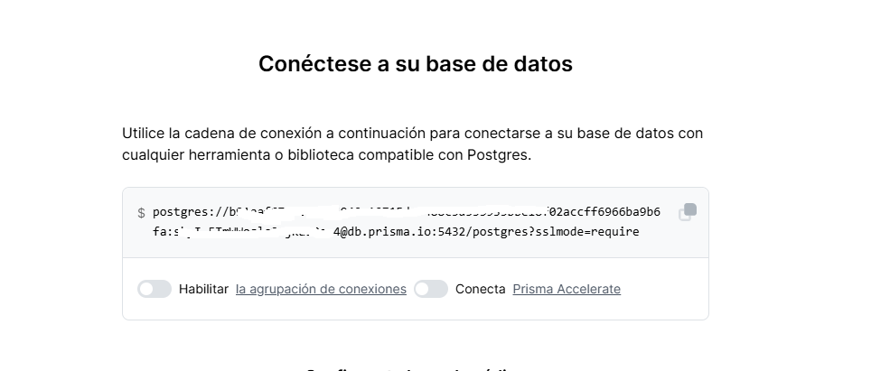
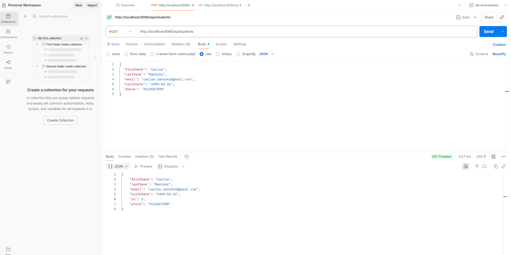
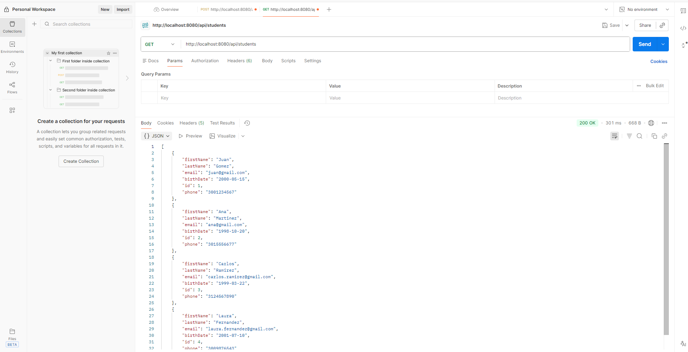
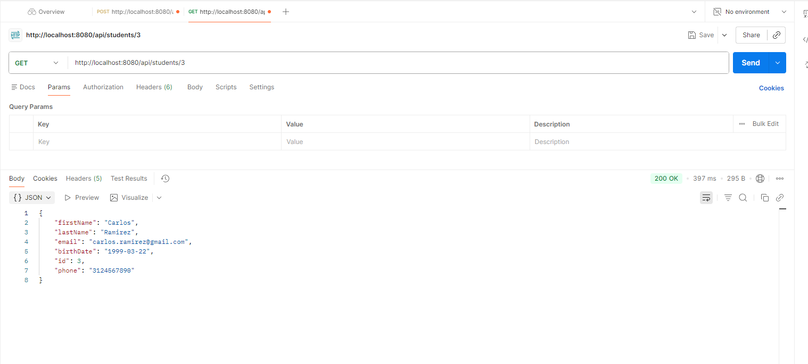
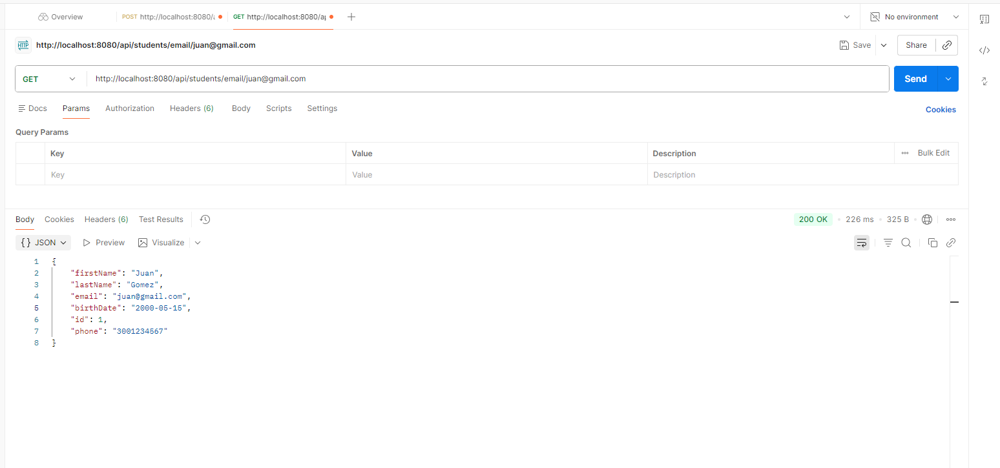
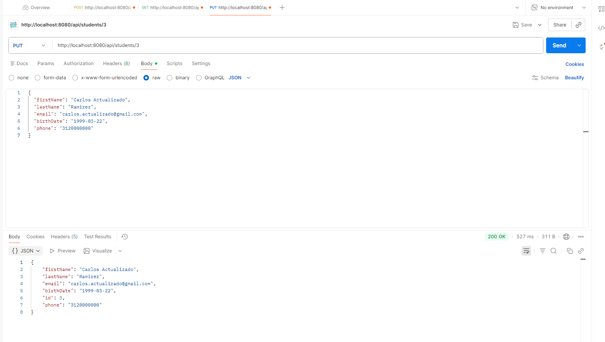
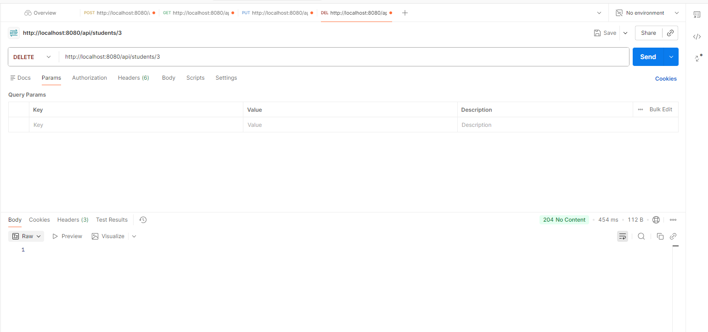
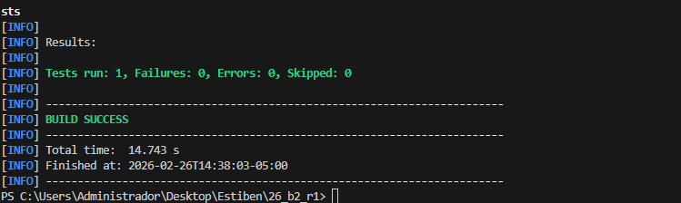

# Proyecto - Sistema de Gestión de Estudiantes

Este es un proyecto backend desarrollado con **Java 21** y **Spring Boot** para la gestión de estudiantes. Incluye una API RESTful que permite crear, leer, actualizar y eliminar (CRUD) registros de estudiantes, persistiendo los datos en una base de datos **PostgreSQL**.

# Estudiante 
Estiben Arley Manco Suarez
CC 1035521456


# EVIDENCIAS

## 🔗 Enlace a la Base de Datos (Prisma)
Instancia creada en Prisma.io:


## 🗄️ Configuración de Base de Datos en Prisma
A continuación se muestra la configuración de la instancia (sin exponer la contraseña):


## 🔌 Conexión Exitosa a PostgreSQL

Log de la consola mostrando conexión exitosa:
[INFO] Scanning for projects...
[INFO] 
[INFO] ----------------------------< com.cesde:pi >----------------------------
[INFO] Building pi 0.0.1-SNAPSHOT
[INFO]   from pom.xml
[INFO] --------------------------------[ jar ]---------------------------------
[INFO] 
[INFO] >>> spring-boot:4.0.2:run (default-cli) > test-compile @ pi >>>
[INFO] 
[INFO] --- resources:3.3.1:resources (default-resources) @ pi ---
[INFO] Copying 1 resource from src\main\resources to target\classes
[INFO] Copying 0 resource from src\main\resources to target\classes
[INFO]
[INFO] --- compiler:3.14.1:compile (default-compile) @ pi ---
[INFO] Nothing to compile - all classes are up to date.
[INFO]
[INFO] --- resources:3.3.1:testResources (default-testResources) @ pi ---
[INFO] Copying 1 resource from src\test\resources to target\test-classes
[INFO]
[INFO] --- compiler:3.14.1:testCompile (default-testCompile) @ pi ---
[INFO] Nothing to compile - all classes are up to date.
[INFO]
[INFO] <<< spring-boot:4.0.2:run (default-cli) < test-compile @ pi <<<
[INFO]
[INFO]
[INFO] --- spring-boot:4.0.2:run (default-cli) @ pi ---
[INFO] Attaching agents: []

  .   ____          _            __ _ _
 /\\ / ___'_ __ _ _(_)_ __  __ _ \ \ \ \
( ( )\___ | '_ | '_| | '_ \/ _` | \ \ \ \
 \\/  ___)| |_)| | | | | || (_| |  ) ) ) )
  '  |____| .__|_| |_|_| |_\__, | / / / /
 =========|_|==============|___/=/_/_/_/

 :: Spring Boot ::                (v4.0.2)

2026-02-26T10:18:52.394-05:00  INFO 15452 --- [pi] [  restartedMain] com.cesde.pi.PiApplication               : Starting PiApplication using Java 21.0.9 with PID 15452 (C:\Users\Administrador\Desktop\Estiben\26_b2_r1\target\classes started by Administrador in C:\Users\Administrador\Desktop\Estiben\26_b2_r1)
2026-02-26T10:18:52.399-05:00  INFO 15452 --- [pi] [  restartedMain] com.cesde.pi.PiApplication               : No active profile set, falling back to 1 default profile: "default"
2026-02-26T10:18:52.478-05:00  INFO 15452 --- [pi] [  restartedMain] .e.DevToolsPropertyDefaultsPostProcessor : Devtools property defaults active! Set 'spring.devtools.add-properties' to 'false' to disable
2026-02-26T10:18:52.479-05:00  INFO 15452 --- [pi] [  restartedMain] .e.DevToolsPropertyDefaultsPostProcessor : For additional web related logging consider setting the 'logging.level.web' property to 'DEBUG'
2026-02-26T10:18:53.560-05:00  INFO 15452 --- [pi] [  restartedMain] .s.d.r.c.RepositoryConfigurationDelegate : Bootstrapping Spring Data JPA repositories in DEFAULT mode.
2026-02-26T10:18:53.635-05:00  INFO 15452 --- [pi] [  restartedMain] .s.d.r.c.RepositoryConfigurationDelegate : Finished Spring Data repository scanning in 60 ms. Found 1 JPA repository interface.
2026-02-26T10:18:54.331-05:00  INFO 15452 --- [pi] [  restartedMain] o.s.boot.tomcat.TomcatWebServer          : Tomcat initialized with port 8080 (http)
2026-02-26T10:18:54.354-05:00  INFO 15452 --- [pi] [  restartedMain] o.apache.catalina.core.StandardService   : Starting service [Tomcat]
2026-02-26T10:18:54.355-05:00  INFO 15452 --- [pi] [  restartedMain] o.apache.catalina.core.StandardEngine    : Starting Servlet engine: [Apache Tomcat/11.0.15]
2026-02-26T10:18:54.415-05:00  INFO 15452 --- [pi] [  restartedMain] b.w.c.s.WebApplicationContextInitializer : Root WebApplicationContext: initialization completed in 1934 ms
2026-02-26T10:18:54.714-05:00  INFO 15452 --- [pi] [  restartedMain] org.hibernate.orm.jpa                    : HHH008540: Processing PersistenceUnitInfo [name: default]
2026-02-26T10:18:54.785-05:00  INFO 15452 --- [pi] [  restartedMain] org.hibernate.orm.core                   : HHH000001: Hibernate ORM core version 7.2.1.Final
2026-02-26T10:18:55.402-05:00  INFO 15452 --- [pi] [  restartedMain] o.s.o.j.p.SpringPersistenceUnitInfo      : No LoadTimeWeaver setup: ignoring JPA class transformer
2026-02-26T10:18:55.450-05:00  INFO 15452 --- [pi] [  restartedMain] com.zaxxer.hikari.HikariDataSource       : HikariPool-1 - Starting...
2026-02-26T10:18:56.535-05:00  INFO 15452 --- [pi] [  restartedMain] com.zaxxer.hikari.pool.HikariPool        : HikariPool-1 - Added connection org.postgresql.jdbc.PgConnection@37a55ca
2026-02-26T10:18:56.538-05:00  INFO 15452 --- [pi] [  restartedMain] com.zaxxer.hikari.HikariDataSource       : HikariPool-1 - Start completed.
2026-02-26T10:18:56.662-05:00  WARN 15452 --- [pi] [  restartedMain] org.hibernate.orm.deprecation            : HHH90000025: PostgreSQLDialect does not need to be specified explicitly using 'hibernate.dialect' (remove the property setting and it will be selected by default)
2026-02-26T10:18:57.022-05:00  INFO 15452 --- [pi] [  restartedMain] org.hibernate.orm.connections.pooling    : HHH10001005: Database info:
        Database JDBC URL [jdbc:postgresql://db.prisma.io:5432/postgres?sslmode=require]
        Database driver: PostgreSQL JDBC Driver
        Database dialect: PostgreSQLDialect
        Database version: 17.2
        Default catalog/schema: postgres/public
        Autocommit mode: undefined/unknown
        Isolation level: READ_COMMITTED [default READ_COMMITTED]
        JDBC fetch size: none
        Pool: DataSourceConnectionProvider
        Minimum pool size: undefined/unknown
        Maximum pool size: undefined/unknown
2026-02-26T10:18:58.167-05:00  INFO 15452 --- [pi] [  restartedMain] org.hibernate.orm.core                   : HHH000489: No JTA platform available (set 'hibernate.transaction.jta.platform' to enable JTA platform integration)
2026-02-26T10:18:58.578-05:00  INFO 15452 --- [pi] [  restartedMain] j.LocalContainerEntityManagerFactoryBean : Initialized JPA EntityManagerFactory for persistence unit 'default'
2026-02-26T10:18:58.696-05:00  INFO 15452 --- [pi] [  restartedMain] o.s.d.j.r.query.QueryEnhancerFactories   : Hibernate is in classpath; If applicable, HQL parser will be used.
2026-02-26T10:18:58.934-05:00  WARN 15452 --- [pi] [  restartedMain] JpaBaseConfiguration$JpaWebConfiguration : spring.jpa.open-in-view is enabled by default. Therefore, database queries may be performed during view rendering. Explicitly configure spring.jpa.open-in-view to disable this warning
2026-02-26T10:18:59.466-05:00  INFO 15452 --- [pi] [  restartedMain] o.s.b.a.e.web.EndpointLinksResolver      : Exposing 1 endpoint beneath base path '/actuator'
2026-02-26T10:18:59.575-05:00  INFO 15452 --- [pi] [  restartedMain] o.s.boot.tomcat.TomcatWebServer          : Tomcat started on port 8080 (http) with context path '/'
2026-02-26T10:18:59.586-05:00  INFO 15452 --- [pi] [  restartedMain] com.cesde.pi.PiApplication               : Started PiApplication in 8.012 seconds (process running for 8.621)
2026-02-26T10:20:40.068-05:00  INFO 15452 --- [pi] [nio-8080-exec-1] o.a.c.c.C.[Tomcat].[localhost].[/]       : Initializing Spring DispatcherServlet 'dispatcherServlet'
2026-02-26T10:20:40.069-05:00  INFO 15452 --- [pi] [nio-8080-exec-1] o.s.web.servlet.DispatcherServlet        : Initializing Servlet 'dispatcherServlet'
2026-02-26T10:20:40.071-05:00  INFO 15452 --- [pi] [nio-8080-exec-1] o.s.web.servlet.DispatcherServlet        : Completed initialization in 2 ms
2026-02-26T10:20:40.194-05:00  WARN 15452 --- [pi] [nio-8080-exec-1] .m.m.a.ExceptionHandlerExceptionResolver : Resolved [org.springframework.web.servlet.resource.NoResourceFoundException: No static resource  for request '/'.]
2026-02-26T10:20:40.341-05:00  WARN 15452 --- [pi] [nio-8080-exec-2] .m.m.a.ExceptionHandlerExceptionResolver : Resolved [org.springframework.web.servlet.resource.NoResourceFoundException: No static resource favicon.ico for request '/favicon.ico'.]
2026-02-26T10:20:45.326-05:00  WARN 15452 --- [pi] [nio-8080-exec-3] .m.m.a.ExceptionHandlerExceptionResolver : Resolved [org.springframework.web.servlet.resource.NoResourceFoundException: No static resource  for request '/'.]
2026-02-26T10:20:45.473-05:00  WARN 15452 --- [pi] [nio-8080-exec-4] .m.m.a.ExceptionHandlerExceptionResolver : Resolved [org.springframework.web.servlet.resource.NoResourceFoundException: No static resource favicon.ico for request '/favicon.ico'.]
2026-02-26T10:20:51.447-05:00  WARN 15452 --- [pi] [nio-8080-exec-5] .m.m.a.ExceptionHandlerExceptionResolver : Resolved [org.springframework.web.servlet.resource.NoResourceFoundException: No static resource  for request '/'.]
2026-02-26T10:20:51.598-05:00  WARN 15452 --- [pi] [nio-8080-exec-6] .m.m.a.ExceptionHandlerExceptionResolver : Resolved [org.springframework.web.servlet.resource.NoResourceFoundException: No static resource favicon.ico for request '/favicon.ico'.]
2026-02-26T10:20:51.752-05:00  WARN 15452 --- [pi] [nio-8080-exec-7] .m.m.a.ExceptionHandlerExceptionResolver : Resolved [org.springframework.web.servlet.resource.NoResourceFoundException: No static resource  for request '/'.]
2026-02-26T10:20:51.865-05:00  WARN 15452 --- [pi] [nio-8080-exec-9] .m.m.a.ExceptionHandlerExceptionResolver : Resolved [org.springframework.web.servlet.resource.NoResourceFoundException: No static resource favicon.ico for request '/favicon.ico'.]
2026-02-26T10:20:51.959-05:00  WARN 15452 --- [pi] [nio-8080-exec-8] .m.m.a.ExceptionHandlerExceptionResolver : Resolved [org.springframework.web.servlet.resource.NoResourceFoundException: No static resource  for request '/'.]
2026-02-26T10:20:52.095-05:00  WARN 15452 --- [pi] [io-8080-exec-10] .m.m.a.ExceptionHandlerExceptionResolver : Resolved [org.springframework.web.servlet.resource.NoResourceFoundException: No static resource favicon.ico for request '/favicon.ico'.]
2026-02-26T10:20:52.146-05:00  WARN 15452 --- [pi] [nio-8080-exec-1] .m.m.a.ExceptionHandlerExceptionResolver : Resolved [org.springframework.web.servlet.resource.NoResourceFoundException: No static resource  for request '/'.]
2026-02-26T10:20:52.282-05:00  WARN 15452 --- [pi] [nio-8080-exec-2] .m.m.a.ExceptionHandlerExceptionResolver : Resolved [org.springframework.web.servlet.resource.NoResourceFoundException: No static resource favicon.ico for request '/favicon.ico'.]


## 🧪 Evidencia de Pruebas de la API (CRUD)

### ➕ Crear Estudiante (POST)
Solicitud y respuesta en Postman:


### 📋 Obtener Todos (GET)


### 🔍 Obtener por ID


### 📧 Obtener por Email


### ✏️ Actualizar Estudiante (PUT)


### 🗑️ Eliminar Estudiante (DELETE)
  

## ✅ Ejecución de Pruebas Internas
Resultado de ejecución de pruebas unitarias:



## 🚀 Tecnologías Utilizadas

- **Java 21**: Lenguaje de programación.
- **Spring Boot 3.x**: Framework para el desarrollo de la aplicación.
- **Maven**: Gestor de dependencias y construcción.
- **PostgreSQL**: Base de datos relacional.
- **Lombok**: Librería para reducir el código boilerplate (Getters, Setters, etc.).
- **Spring Data JPA**: Abstracción para la capa de persistencia.

## 📋 Requisitos Previos

Asegúrate de tener instalado lo siguiente en tu entorno local:

- [Java JDK 21](https://www.oracle.com/java/technologies/downloads/#java21)
- [Maven](https://maven.apache.org/download.cgi)
- Cliente para probar la API (como [Postman](https://www.postman.com/) o [Insomnia](https://insomnia.rest/)).

## ⚙️ Configuración

La configuración de la base de datos se maneja a través de variables de entorno definidas en un archivo `.env` en la raíz del proyecto.

1.  Copia el archivo de ejemplo:
    ```bash
    copy .env.example .env
    ```

2.  Edita el archivo `.env` y define tus credenciales:
    ```ini
    DB_URL=jdbc:postgresql://localhost:5432/tu_base_de_datos
    DB_USERNAME=tu_usuario
    DB_PASSWORD=tu_contraseña
    ```

> **Nota:** El archivo `.env` está excluido del control de versiones para mantener tus credenciales seguras.

## 🛠️ Instalación y Ejecución (Windows)

1.  **Clonar el repositorio**:
    ```powershell
    git clone <url-del-repositorio>
    cd pi
    ```

2.  **Compilar el proyecto**:
    Asegúrate de estar en la raíz del proyecto y ejecuta:
    ```powershell
    .\mvnw.cmd clean install
    ```
    *Nota: Si tienes Maven instalado globalmente, puedes usar simplemente `mvn clean install`.*

3.  **Ejecutar la aplicación**:
    ```powershell
    .\mvnw.cmd spring-boot:run
    ```

    La aplicación se iniciará en el puerto `8080` (por defecto).

## 🔌 Uso de la API (Endpoints)

La API base es `/api/students`. A continuación se detallan los endpoints disponibles:

### 1. Obtener todos los estudiantes
- **Método**: `GET`
- **URL**: `/api/students`
- **Respuesta**: Lista de estudiantes en formato JSON.

### 2. Obtener un estudiante por ID
- **Método**: `GET`
- **URL**: `/api/students/{id}`
- **Ejemplo**: `/api/students/1`

### 3. Obtener un estudiante por Email
- **Método**: `GET`
- **URL**: `/api/students/email/{email}`
- **Ejemplo**: `/api/students/email/ejemplo@correo.com`

### 4. Crear un nuevo estudiante
- **Método**: `POST`
- **URL**: `/api/students`
- **Body (JSON)**:
    ```json
    {
      "firstName": "Juan",
      "lastName": "Pérez",
      "email": "juan.perez@example.com",
      "birthDate": "2000-01-15",
      "phone": "1234567890"
    }
    ```

### 5. Actualizar un estudiante
- **Método**: `PUT`
- **URL**: `/api/students/{id}`
- **Ejemplo**: `/api/students/1`
- **Body (JSON)**:
    ```json
    {
      "firstName": "Juan Carlos",
      "lastName": "Pérez",
      "email": "juan.perez@example.com",
      "birthDate": "2000-01-15",
      "phone": "0987654321"
    }
    ```

### 6. Eliminar un estudiante
- **Método**: `DELETE`
- **URL**: `/api/students/{id}`
- **Ejemplo**: `/api/students/1`

## 🧪 Ejecutar Pruebas

Para ejecutar las pruebas unitarias y de integración, usa el siguiente comando:

```powershell
.\mvnw.cmd test
```

## 📂 Estructura del Proyecto

```
src/main/java/com/cesde/pi
├── controller    # Controladores REST (StudentController)
├── model         # Entidades JPA (Student)
├── repository    # Interfaces de Repositorio (StudentRepository)
├── service       # Lógica de Negocio (StudentService)
├── dto           # Objetos de Transferencia de Datos
└── exception     # Manejo de Excepciones Globales
```
